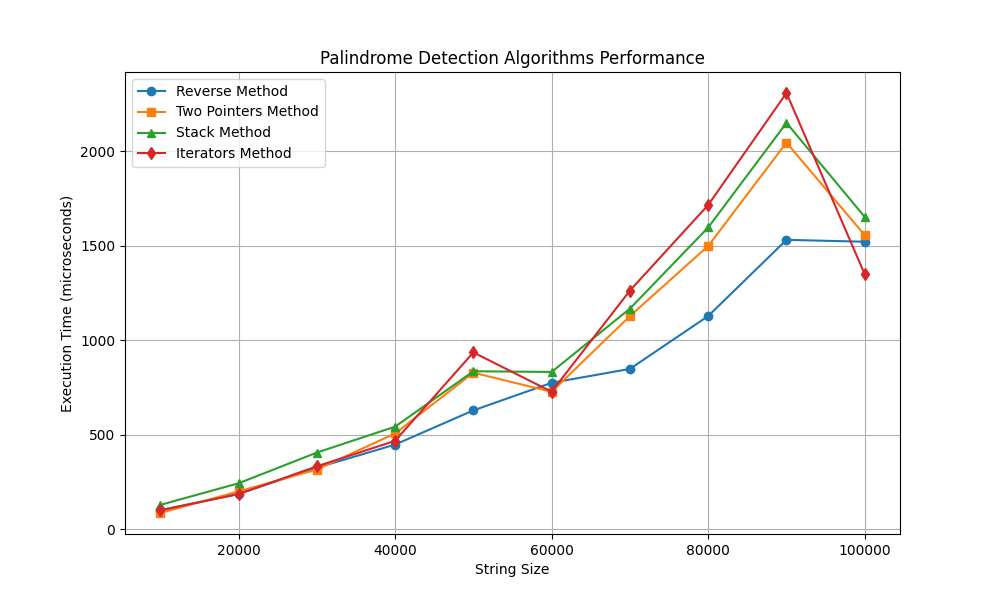
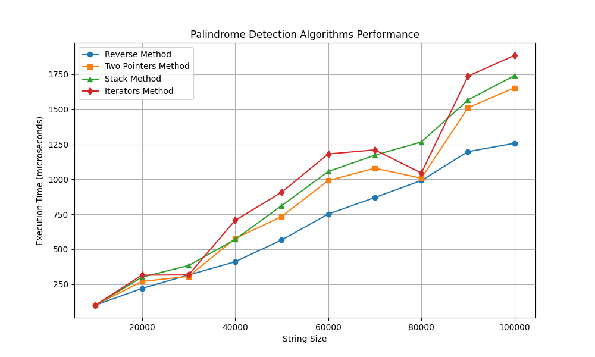

# Palindrome Detection

## Description
This project implements and compares different algorithms to check whether a string is a **palindrome**. It also includes unit tests and execution time analysis.

---

## **Implemented Algorithms**
The algorithms used to detect whether a string is a palindrome are in **`algorithms.py`** and include:

### **Two Pointers Method (`isPalindromeTwoPointers`)**
 **Description:**  
Compares characters from the beginning and end, moving the pointers toward the center.

 **Complexity:**  
- **Time:** O(n)   

---

### **Stack Method (`isPalindromeStack`)**
 **Description:**  
Stores the first half of the string in a stack and then compares it with the second half.

 **Complexity:**  
- **Time:** O(n)

---

### **Reverse Method (`isPalindromeReverse`)**
 **Description:**  
Reverses the string and compares it with the original.

 **Complexity:**  
- **Time:** O(n)   

---

### **Iterators Method (`isPalindromeIterators`)**
 **Description:**  
Compares the original string with its reverse using `zip()`.

 **Complexity:**  
- **Time:** O(n)   

---

##  **Unit Tests**
The project includes tests in **`test/`** to verify the correct functionality of the algorithms and data generation:

 **Run tests:**
```bash
python -m unittest discover test
```

Test Coverage
we use ```coverage.py```

```
coverage run --source=palindrome --omit=palindrome/constants.py,palindrome/execution_time_gathering.py,palindrome/plot.py -m unittest discover
coverage report -m
```

Coverage Report
```
Name                           Stmts   Miss  Cover   Missing
------------------------------------------------------------
palindrome\__init__.py             0      0   100%
palindrome\algorithms.py          27      0   100%
palindrome\data_generator.py       9      1    89%   10
------------------------------------------------------------
TOTAL                             36      1    97%
```

---
Graphs






